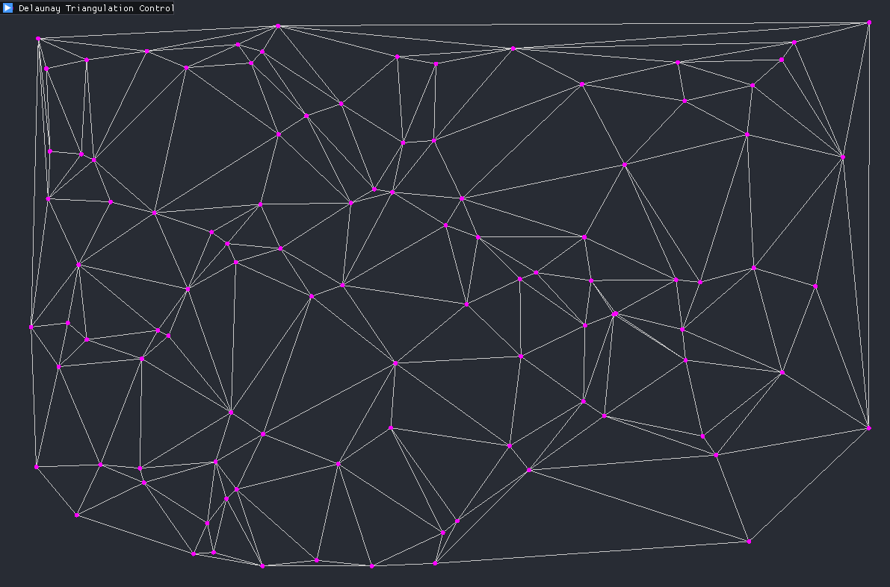

# Delaunay Triangulation

Учебный проект: реализация **триангуляции Делоне** для набора точек на плоскости.  

## О проекте
Триангуляция Делоне — разбиение плоскости на треугольники, при котором для каждого треугольника окружность, описанная вокруг него, не содержит других точек множества.

## Что реализовано
- Построение триангуляции Делоне по заданному набору точек.
- Визуализация точек и ребер.
- Интерактивное управление (через ImGui): количество точек, действия со сценой.

## Управление
- `LMB` — добавить точку
- `Esc` — выход

## Используемые библиотеки
- **SFML**
- **ImGui**
